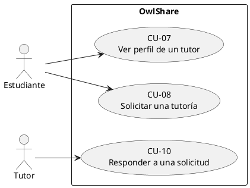
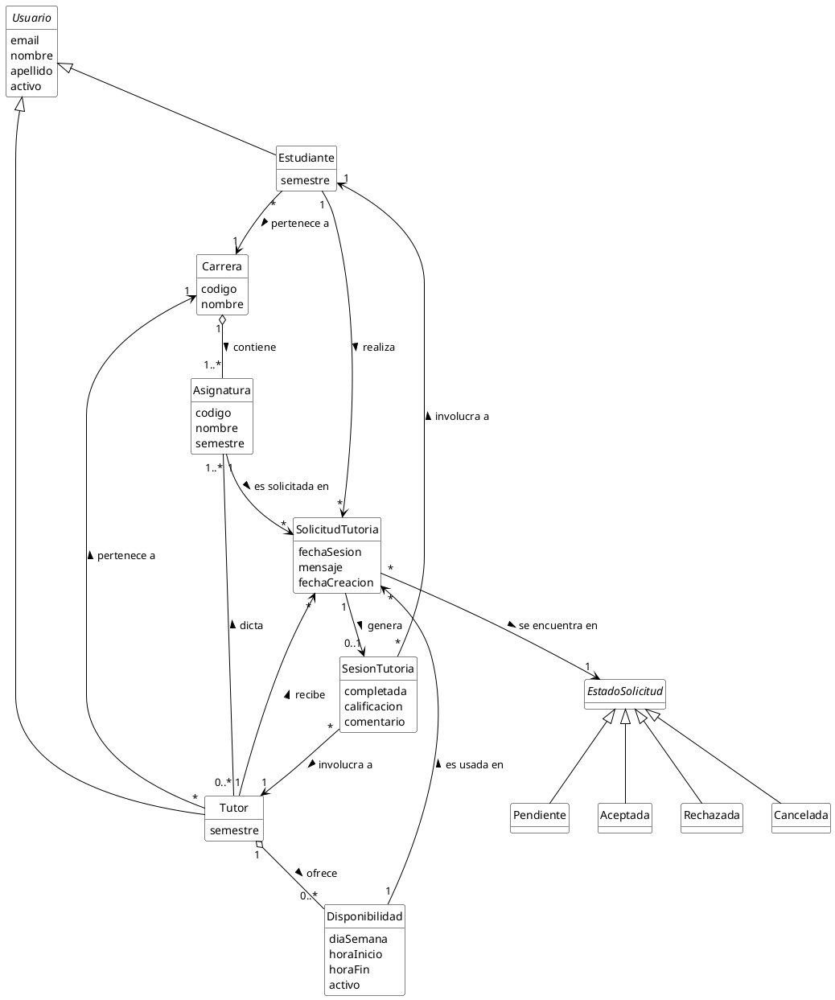
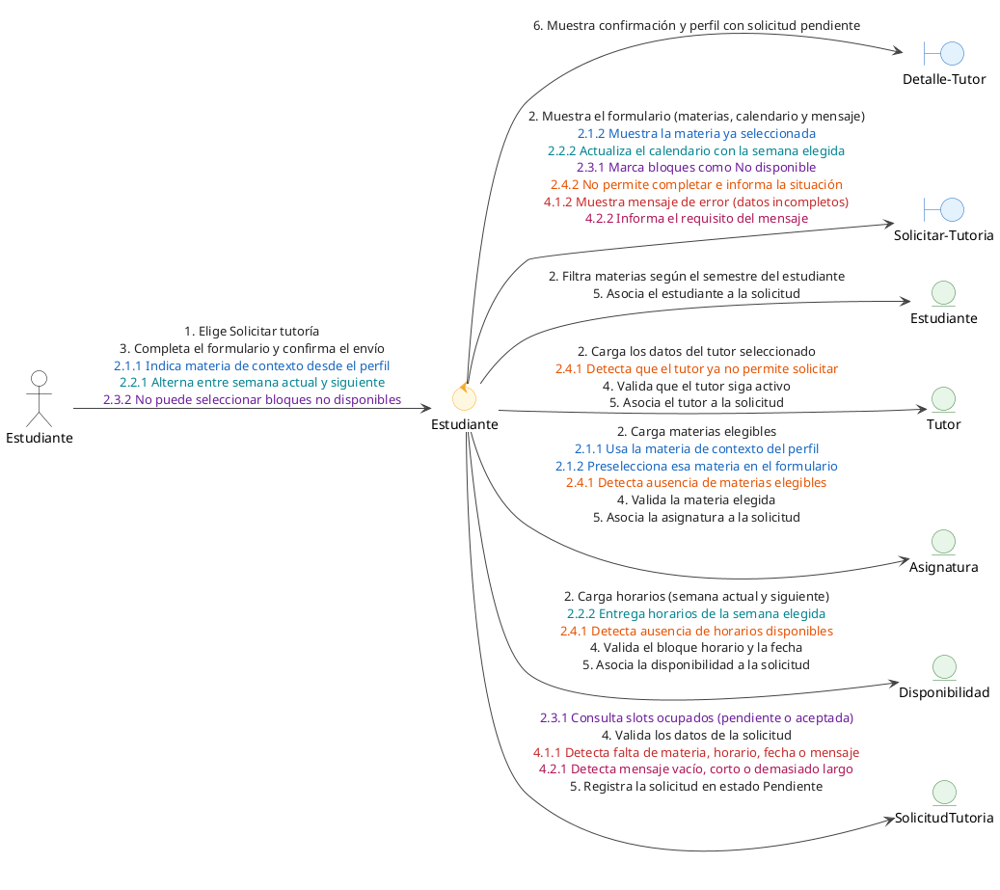
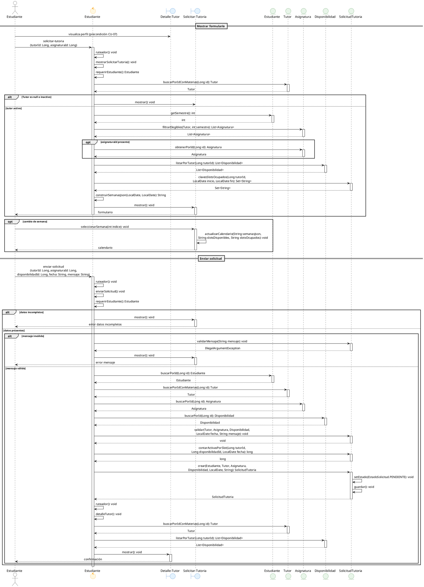

# CU-08 — Solicitar una tutoría

## Actores

- **Estudiante** (actor principal): usuario autenticado que necesita apoyo en una materia y solicita una sesión con un tutor.
- **Tutor**: no interactúa en este caso de uso; solo queda como destinatario de la solicitud en estado pendiente (su interacción ocurre en CU-10).

## Descripción

Partiendo del **perfil del tutor**, el estudiante inicia la solicitud de tutoría, completa el formulario (materia, horario disponible en la semana actual o siguiente, y mensaje) y lo envía. El sistema valida los datos, registra la solicitud en estado **Pendiente** y confirma el resultado al estudiante.

La búsqueda del tutor (con o sin filtro de materia) corresponde a casos de uso previos; este caso de uso comienza cuando el estudiante ya está visualizando el perfil.

## Precondiciones

1. El estudiante tiene una sesión activa en OwlShare.
2. El estudiante se encuentra visualizando el **perfil del tutor** (CU-07).
3. El tutor está activo, ofrece al menos una materia que el estudiante puede solicitar según su semestre, y tiene horarios de disponibilidad configurados.
4. El horario que se elija deberá pertenecer a la **semana actual** o a la **semana siguiente**, no haber pasado y no estar ocupado por otra solicitud pendiente o aceptada del mismo tutor.

## Postcondiciones

### Éxito

- Se crea una solicitud de tutoría en estado **Pendiente**.
- La solicitud queda visible en **Mis solicitudes** del estudiante.
- El horario seleccionado queda **bloqueado** para otros estudiantes mientras la solicitud esté pendiente o aceptada.
- El estudiante recibe confirmación visual de que la solicitud fue enviada.

### Fallo

- No se crea ninguna solicitud.
- El estudiante permanece en el formulario o vuelve a él con un mensaje que explica el motivo.

## Flujo principal

1. Desde el perfil del tutor, el estudiante elige **Solicitar tutoría**.
2. El sistema muestra el formulario de solicitud: materias elegibles, calendario de horarios (semana actual y siguiente) y campo de mensaje.
3. El estudiante completa el formulario (materia, bloque horario libre y mensaje de 10 a 500 caracteres) y confirma el envío.
4. El sistema valida los datos de la solicitud.
5. El sistema registra la solicitud en estado **Pendiente**.
6. El sistema muestra un mensaje de confirmación y redirige al perfil del tutor indicando que la solicitud quedó pendiente de respuesta.

## Flujos alternativos y de excepción

### 2.1 — Materia ya preseleccionada

2.1.1. En el paso 2, el perfil del tutor se abrió con una materia de contexto (por ejemplo, tras filtrar en la búsqueda).  
2.1.2. El sistema muestra esa materia ya seleccionada en el formulario.  
2.1.3. El flujo continúa en el paso 3.

### 2.2 — Cambio de semana en el calendario

2.2.1. En el paso 2, el estudiante alterna entre la semana actual y la semana siguiente.  
2.2.2. El sistema actualiza el calendario con los horarios de la semana elegida.  
2.2.3. El flujo continúa en el paso 3.

### 2.3 — Horario no disponible en pantalla

2.3.1. En el paso 2, el sistema marca algunos bloques como **No disponible** porque la fecha ya pasó o ya tienen una solicitud pendiente o aceptada.  
2.3.2. El estudiante no puede seleccionar esos bloques.  
2.3.3. El flujo continúa en el paso 3.

### 2.4 — El tutor ya no permite solicitar

2.4.1. En el paso 2, el tutor dejó de estar activo, no tiene materias elegibles o no tiene horarios disponibles.  
2.4.2. El sistema no permite completar la solicitud e informa la situación.  
2.4.3. El caso de uso termina sin crear solicitud.

### 4.1 — Datos incompletos

4.1.1. En el paso 4, falta materia, horario, fecha o mensaje.  
4.1.2. El sistema muestra un mensaje de error.  
4.1.3. El flujo regresa al paso 3.

### 4.2 — Mensaje inválido

4.2.1. En el paso 4, el mensaje está vacío, tiene menos de 10 caracteres o supera 500.  
4.2.2. El sistema informa el requisito del mensaje.  
4.2.3. El flujo regresa al paso 3.

---

**Caso de uso previo:** CU-07 — Ver perfil de un tutor.  
**Caso de uso relacionado:** CU-10 — Responder a una solicitud (cuando el tutor acepta o rechaza).

## Diagrama de casos de uso

## Modelo de dominio

## Diagrama de robustez

## Diagrama de secuencia de diseño

## Diagrama de clases de diseño

```plantuml
@startuml CU-08-DisenoClases
skinparam backgroundColor white
skinparam shadowing false
skinparam classAttributeIconSize 0
skinparam class {
  BackgroundColor white
  BorderColor black
}
hide empty members

class "Detalle-Tutor" {
  + mostrar(): void
}

class "Solicitar-Tutoria" {
  + mostrar(): void
  + seleccionarSemana(indice: int): void
  + actualizarCalendario(semanasJson: String, slotsDisponibles: String, slotsOcupados: String): void
}

class EstudianteController {
  - tutorDAO: TutorDAO
  - disponibilidadService: DisponibilidadService
  - solicitudService: SolicitudService
  --
  + doGet(req: HttpServletRequest, resp: HttpServletResponse): void
  + doPost(req: HttpServletRequest, resp: HttpServletResponse): void
  - ruteador(req: HttpServletRequest, resp: HttpServletResponse): void
  - mostrarSolicitarTutoria(req: HttpServletRequest, resp: HttpServletResponse): void
  - enviarSolicitud(req: HttpServletRequest, resp: HttpServletResponse): void
  - detalleTutor(req: HttpServletRequest, resp: HttpServletResponse): void
  - requerirEstudiante(req: HttpServletRequest, resp: HttpServletResponse): Estudiante
  - filtrarMateriasParaEstudiante(tutor: Tutor, estudiante: Estudiante): List<Asignatura>
  - listarHorariosOrdenados(tutorId: Long): List<Disponibilidad>
  - construirSemanasJson(lunesActual: LocalDate, lunesSiguiente: LocalDate): String
  - construirSemanaJson(indice: int, etiqueta: String, lunes: LocalDate): String
  - escaparJson(valor: String): String
  - parseLong(valor: String): Long
  - parseFecha(valor: String): LocalDate
  - encode(valor: String): String
}

class SolicitudService {
  - solicitudDAO: SolicitudDAO
  - tutorDAO: TutorDAO
  - asignaturaDAO: AsignaturaDAO
  - disponibilidadDAO: DisponibilidadDAO
  - usuarioDAO: UsuarioDAO
  --
  + {static} claveSlot(disponibilidadId: Long, fecha: LocalDate): String
  + crear(estudianteId: Long, tutorId: Long, asignaturaId: Long, disponibilidadId: Long, fechaSesion: LocalDate, mensaje: String): SolicitudTutoria
  + clavesSlotsOcupados(tutorId: Long, inicioSemana: LocalDate, finSemana: LocalDate): Set<String>
  + listarPorTutor(tutorId: Long): List<SolicitudTutoria>
  + listarPorEstudiante(estudianteId: Long): List<SolicitudTutoria>
  + listarProximasSesionesEstudiante(estudianteId: Long): List<SolicitudTutoria>
  + listarProximasSesionesTutor(tutorId: Long): List<SolicitudTutoria>
  + responderSolicitud(solicitudId: Long, tutorId: Long, nuevoEstado: EstadoSolicitud): SolicitudTutoria
  + cancelarPorEstudiante(solicitudId: Long, estudianteId: Long): void
  + cancelarPorTutor(solicitudId: Long, tutorId: Long): void
}

class DisponibilidadService {
  - disponibilidadDAO: DisponibilidadDAO
  --
  + listarPorTutor(tutorId: Long): List<Disponibilidad>
  + slotsComoCadena(tutorId: Long): String
  + listarSlotKeys(tutorId: Long): List<String>
  + reemplazarSlots(tutorId: Long, slotsCsv: String): void
}

class TutorDAO {
  + buscarPorIdConMaterias(id: Long): Tutor
  + actualizar(tutor: Tutor): void
  + buscar(carreraId: Long, asignaturaId: Long): List<Tutor>
  + buscar(carreraId: Long, asignaturaId: Long, semestreMax: Integer): List<Tutor>
  + buscarAsignaturasPorIds(asignaturaIds: Set<Long>): List<Asignatura>
}

class SolicitudDAO {
  + guardar(solicitud: SolicitudTutoria): void
  + buscarPorId(id: Long): SolicitudTutoria
  + buscarPorIdConRelaciones(id: Long): SolicitudTutoria
  + actualizar(solicitud: SolicitudTutoria): void
  + contarActivasPorSlot(tutorId: Long, disponibilidadId: Long, fecha: LocalDate): long
  + listarActivasPorTutorEnRango(tutorId: Long, inicioSemana: LocalDate, finSemana: LocalDate): List<SolicitudTutoria>
  + listarPorTutor(tutorId: Long): List<SolicitudTutoria>
  + listarPorEstudiante(estudianteId: Long): List<SolicitudTutoria>
  + listarAceptadasDesdeHoy(estudianteId: Long, tutorId: Long): List<SolicitudTutoria>
}

class DisponibilidadDAO {
  + buscarPorId(id: Long): Disponibilidad
  + listarPorTutor(tutorId: Long): List<Disponibilidad>
  + sincronizarSlots(tutorId: Long, slotsDeseados: Set<String>): void
  + guardar(disponibilidad: Disponibilidad): void
  + guardarTodos(disponibilidades: List<Disponibilidad>): void
}

class UsuarioDAO {
  + buscarPorEmail(email: String): Usuario
  + buscarPorId(id: Long): Optional<Usuario>
  + contar(): long
  + guardar(usuario: Usuario): void
  + actualizar(usuario: Usuario): void
}

class AsignaturaDAO {
  + listarPorCarrera(carreraId: Long): List<Asignatura>
  + listarPorCarreraHastaSemestre(carreraId: Long, semestreMaximo: int): List<Asignatura>
  + listarAprobadasParaTutor(carreraId: Long, semestreTutor: int): List<Asignatura>
  + buscarPorId(id: Long): Asignatura
  + buscarPorIds(ids: List<Long>): List<Asignatura>
}

abstract class Usuario {
  - id: Long
  - email: String
  - password: String
  - nombre: String
  - segundoNombre: String
  - apellido: String
  - segundoApellido: String
  - activo: boolean
  --
  + getId(): Long
  + setId(id: Long): void
  + getEmail(): String
  + setEmail(email: String): void
  + getPassword(): String
  + setPassword(password: String): void
  + getNombre(): String
  + setNombre(nombre: String): void
  + getSegundoNombre(): String
  + setSegundoNombre(segundoNombre: String): void
  + getApellido(): String
  + setApellido(apellido: String): void
  + getSegundoApellido(): String
  + setSegundoApellido(segundoApellido: String): void
  + isActivo(): boolean
  + setActivo(activo: boolean): void
  + getNombreCompleto(): String
}

class Estudiante {
  - semestre: int
  - carrera: Carrera
  --
  + getSemestre(): int
  + setSemestre(semestre: int): void
  + getCarrera(): Carrera
  + setCarrera(carrera: Carrera): void
}

class Tutor {
  - semestre: int
  - carrera: Carrera
  - materias: Set<Asignatura>
  --
  + getSemestre(): int
  + setSemestre(semestre: int): void
  + getCarrera(): Carrera
  + setCarrera(carrera: Carrera): void
  + getMaterias(): Set<Asignatura>
  + setMaterias(materias: Set<Asignatura>): void
}

class Carrera {
  - id: Long
  - codigo: String
  - nombre: String
  - asignaturas: List<Asignatura>
  --
  + getId(): Long
  + setId(id: Long): void
  + getCodigo(): String
  + setCodigo(codigo: String): void
  + getNombre(): String
  + setNombre(nombre: String): void
  + getAsignaturas(): List<Asignatura>
  + setAsignaturas(asignaturas: List<Asignatura>): void
}

class Asignatura {
  - id: Long
  - codigo: String
  - nombre: String
  - semestre: int
  - carrera: Carrera
  --
  + getId(): Long
  + setId(id: Long): void
  + getCodigo(): String
  + setCodigo(codigo: String): void
  + getNombre(): String
  + setNombre(nombre: String): void
  + getSemestre(): int
  + setSemestre(semestre: int): void
  + getCarrera(): Carrera
  + setCarrera(carrera: Carrera): void
}

class Disponibilidad {
  - id: Long
  - tutor: Tutor
  - diaSemana: DiaSemana
  - horaInicio: String
  - horaFin: String
  - activo: boolean
  --
  + getId(): Long
  + setId(id: Long): void
  + getTutor(): Tutor
  + setTutor(tutor: Tutor): void
  + getDiaSemana(): DiaSemana
  + setDiaSemana(diaSemana: DiaSemana): void
  + getHoraInicio(): String
  + setHoraInicio(horaInicio: String): void
  + getHoraFin(): String
  + setHoraFin(horaFin: String): void
  + isActivo(): boolean
  + setActivo(activo: boolean): void
  + toSlotKey(): String
}

class SolicitudTutoria {
  - id: Long
  - estudiante: Estudiante
  - tutor: Tutor
  - asignatura: Asignatura
  - disponibilidad: Disponibilidad
  - fechaSesion: LocalDate
  - mensaje: String
  - estado: EstadoSolicitud
  - fechaCreacion: LocalDateTime
  --
  + getId(): Long
  + setId(id: Long): void
  + getEstudiante(): Estudiante
  + setEstudiante(estudiante: Estudiante): void
  + getTutor(): Tutor
  + setTutor(tutor: Tutor): void
  + getAsignatura(): Asignatura
  + setAsignatura(asignatura: Asignatura): void
  + getDisponibilidad(): Disponibilidad
  + setDisponibilidad(disponibilidad: Disponibilidad): void
  + getFechaSesion(): LocalDate
  + setFechaSesion(fechaSesion: LocalDate): void
  + getMensaje(): String
  + setMensaje(mensaje: String): void
  + getEstado(): EstadoSolicitud
  + setEstado(estado: EstadoSolicitud): void
  + getFechaCreacion(): LocalDateTime
  + setFechaCreacion(fechaCreacion: LocalDateTime): void
}

enum EstadoSolicitud {
  PENDIENTE
  ACEPTADA
  RECHAZADA
  CANCELADA
  etiqueta: String
  --
  + getEtiqueta(): String
}

enum DiaSemana {
  LUNES
  MARTES
  MIERCOLES
  JUEVES
  VIERNES
  SABADO
  DOMINGO
  etiqueta: String
  --
  + getEtiqueta(): String
  + toDayOfWeek(): DayOfWeek
  + {static} from(dayOfWeek: DayOfWeek): DiaSemana
  + {static} parse(valor: String): DiaSemana
}

EstudianteController ..> "Detalle-Tutor" : muestra >
EstudianteController ..> "Solicitar-Tutoria" : muestra >
EstudianteController --> SolicitudService : delega en >
EstudianteController --> DisponibilidadService : consulta >
EstudianteController --> TutorDAO : consulta >

SolicitudService --> SolicitudDAO : persiste mediante >
SolicitudService --> TutorDAO : consulta >
SolicitudService --> AsignaturaDAO : consulta >
SolicitudService --> DisponibilidadDAO : consulta >
SolicitudService --> UsuarioDAO : consulta >

DisponibilidadService --> DisponibilidadDAO : persiste mediante >

Usuario <|-- Estudiante : es un >
Usuario <|-- Tutor : es un >

Estudiante "*" --> "1" Carrera : pertenece a >
Tutor "*" --> "1" Carrera : pertenece a >
Carrera "1" o-- "1..*" Asignatura : contiene >
Tutor "0..*" -- "1..*" Asignatura : dicta >
Tutor "1" o-- "0..*" Disponibilidad : ofrece >
Disponibilidad --> DiaSemana : se agenda en >

Estudiante "1" --> "*" SolicitudTutoria : realiza >
Tutor "1" --> "*" SolicitudTutoria : recibe >
Asignatura "1" --> "*" SolicitudTutoria : es solicitada en >
Disponibilidad "1" --> "*" SolicitudTutoria : es usada en >
SolicitudTutoria --> EstadoSolicitud : se encuentra en >

TutorDAO ..> Tutor : gestiona >
SolicitudDAO ..> SolicitudTutoria : gestiona >
DisponibilidadDAO ..> Disponibilidad : gestiona >
AsignaturaDAO ..> Asignatura : gestiona >
UsuarioDAO ..> Usuario : gestiona >

@enduml
```

